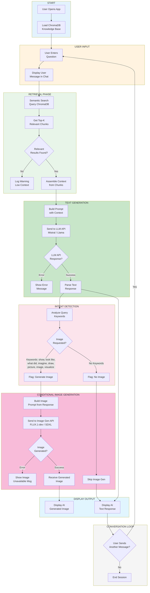
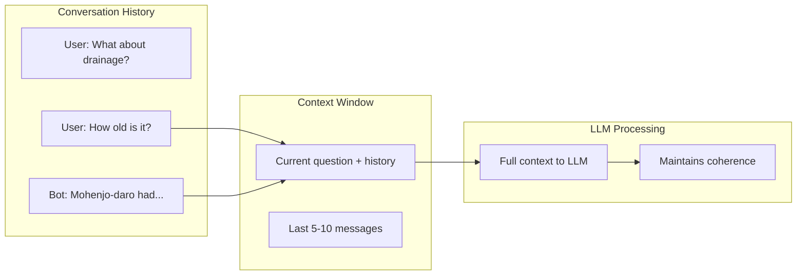
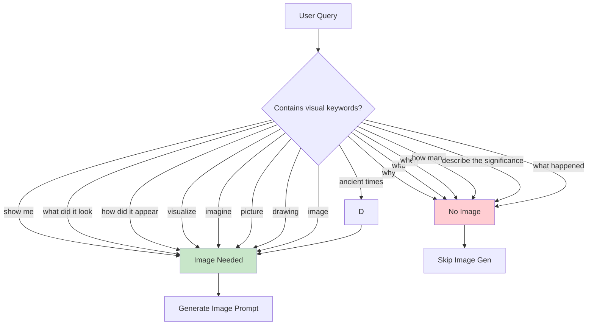
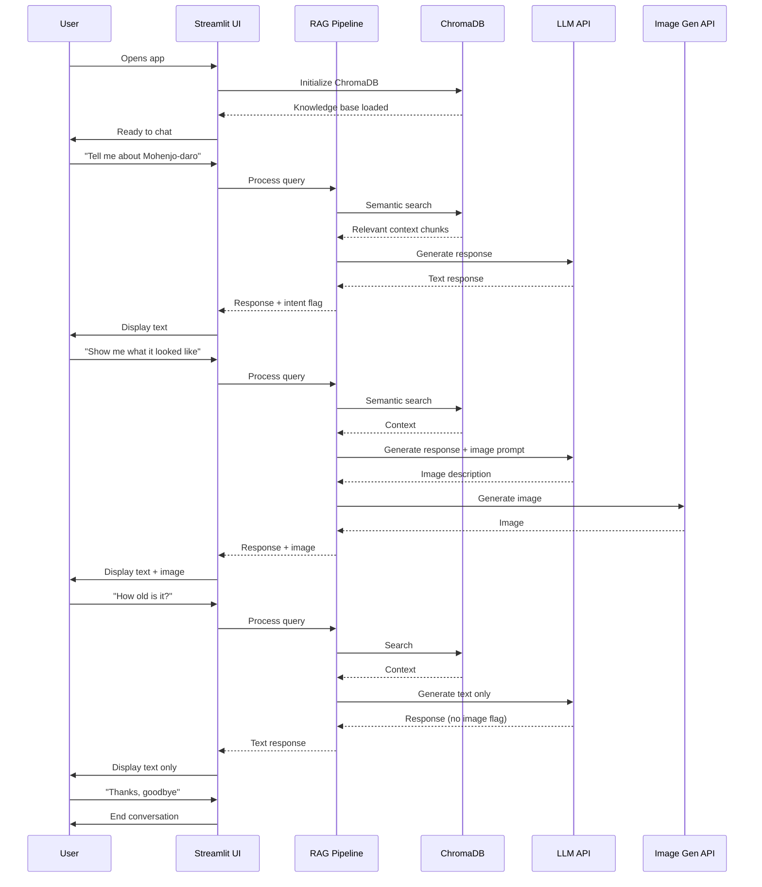

# Mohenjo-daro AI Chatbot - Detailed Workflow Diagram

## Complete Chatbot Workflow



---

## Detailed Step-by-Step Flow

```mermaid
flowchart TD
    subgraph Step1["STEP 1: App Initialization"]
        S1_1[App Starts] --> S1_2[Initialize Streamlit]
        S1_2 --> S1_3[Load ChromaDB from Repo]
        S1_3 --> S1_4[Initialize LangChain]
        S1_4 --> S1_5[Setup Hugging Face API Clients]
        S1_5 --> S1_6[Ready for User Input]
    end

    subgraph Step2["STEP 2: User Query Processing"]
        S2_1[User Types Question] --> S2_2[st.chat_input captures input]
        S2_2 --> S2_3[Add to conversation history]
        S2_3 --> S2_4[Display in st.chat_message]
        S2_4 --> S2_5[Store in message history]
    end

    subgraph Step3["STEP 3: RAG Retrieval"]
        S3_1[Extract query string] --> S3_2[Generate query embedding]
        S3_2 --> S3_3[similarity_search in ChromaDB]
        S3_3 --> S3_4[Retrieve top 4-5 chunks]
        S3_4 --> S3_5[Combine as context string]
        S3_5 --> S3_6[Pass to LLM prompt]
    end

    subgraph Step4["STEP 4: LLM Response Generation"]
        S4_1[Build system prompt<br/>with context] --> S4_2[Build user prompt<br/>with question + history]
        S4_2 --> S4_3[Call Hugging Face<br/>LLM Inference API]
        S4_3 --> S4_4{API Success?}
        S4_4 -->|Yes| S4_5[Extract response text]
        S4_4 -->|No| S4_6[Return error message]
        S4_5 --> S4_7[Add to conversation history]
    end

    subgraph Step5["STEP 5: Intent Classification"]
        S5_1[Check keywords in query] --> S5_2{Keywords found?}
        S5_2 -->|show| S5_3[image_needed = True]
        S5_2 -->|look like| S5_3
        S5_2 -->|what did| S5_3
        S5_2 -->|imagine| S5_3
        S5_2 -->|picture| S5_3
        S5_2 -->|visualize| S5_3
        S5_2 -->|other| S5_4[image_needed = False]
        S5_3 --> S5_5[Flag set for image generation]
        S5_4 --> S5_5
    end

    subgraph Step6["STEP 6: Conditional Image Generation"]
        S6_1{image_needed?}
        S6_1 -->|Yes| S6_2[Extract visual description from LLM response]
        S6_2 --> S6_3[Enhance prompt for image model]
        S6_3 --> S6_4[Add historical context to prompt]
        S6_4 --> S6_5[Call Hugging Face Image Gen API]
        S6_5 --> S6_6{API Success?}
        S6_6 -->|Yes| S6_7[Receive image bytes]
        S6_6 -->|No| S6_8[Show fallback message]
        S6_7 --> S6_9[Display image in chat]
        S6_1 -->|No| S6_10[Skip - continue to display]
    end

    subgraph Step7["STEP 7: Display Response"]
        S7_1[Streamlit renders text] --> S7_2[st.chat_message bot]
        S7_2 --> S7_3{Image generated?}
        S7_3 -->|Yes| S7_4[st.image display]
        S7_3 -->|No| S7_5[Skip image]
        S7_4 --> S7_6[Chat history updated]
        S7_5 --> S7_6
    end

    subgraph Step8["STEP 8: Conversation Memory"]
        S8_1[Append user message to history]
        S8_1 --> S8_2[Append bot response to history]
        S8_2 --> S8_3[Pass history to next LLM call]
        S8_3 --> S8_4[Enables multi-turn conversation]
    end
```



---

## Conversation Memory Flow



---

## Image Generation Decision Logic



---

## API Error Handling Flow

```mermaid
flowchart TD
    A[API Call] --> B{Success?}

    B -->|200 OK| C[Process Response]
    B -->|429 Rate Limit| D[Show: "Please wait..."]
    D --> E[Wait 30 seconds]
    E --> A
    B -->|500 Server Error| F[Show: "Service unavailable"]
    F --> G[Log error]
    B -->|Timeout| H[Show: "Request timed out"]
    H --> I[Retry once]
    I --> A

    style D fill:#fff3e0
    style F fill:#ffcdd2
    style H fill:#fff3e0
```

---

## Complete User Session Flow



---

## Workflow Summary Table

| Step | Component | Action | Output |
|------|-----------|--------|--------|
| 1 | Streamlit | Initialize app | App ready |
| 2 | UI | Capture user input | Question stored |
| 3 | ChromaDB | Semantic search | Context chunks |
| 4 | LLM | Generate response | Text answer |
| 5 | Intent | Classify query | Image flag |
| 6 | Image Gen | Generate image | Visual |
| 7 | UI | Display output | Chat message |
| 8 | Memory | Update history | Conversation state |

---

## Key Code Integration Points

```
app.py
│
├── initialize_app()
│   └── load_chroma_db()
│
├── handle_user_input(user_input)
│   └── add_to_history()
│
├── process_query(query)
│   ├── semantic_search(chroma_db, query)
│   ├── generate_response(llm, context, query)
│   └── classify_intent(query)
│
├── generate_image(prompt)
│   └── image_generation_api(flux, prompt)
│
└── display_response(text, image)
    ├── st.chat_message("assistant")
    └── st.image(image)
```
