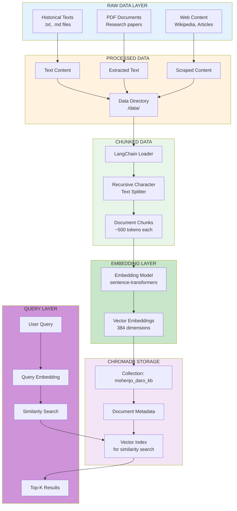
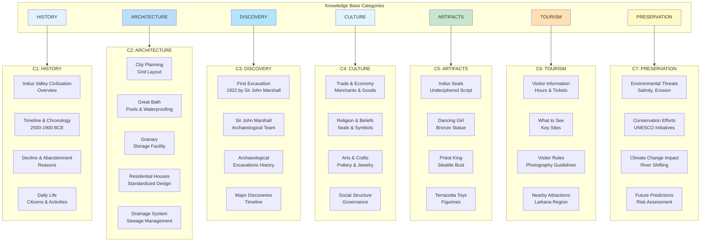
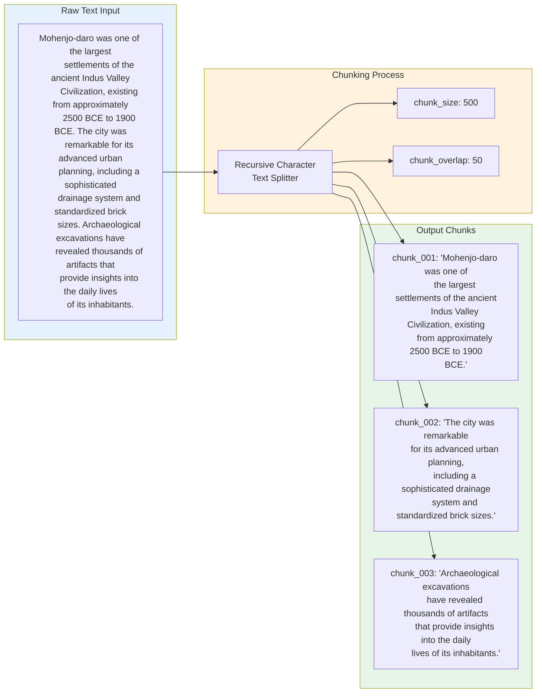
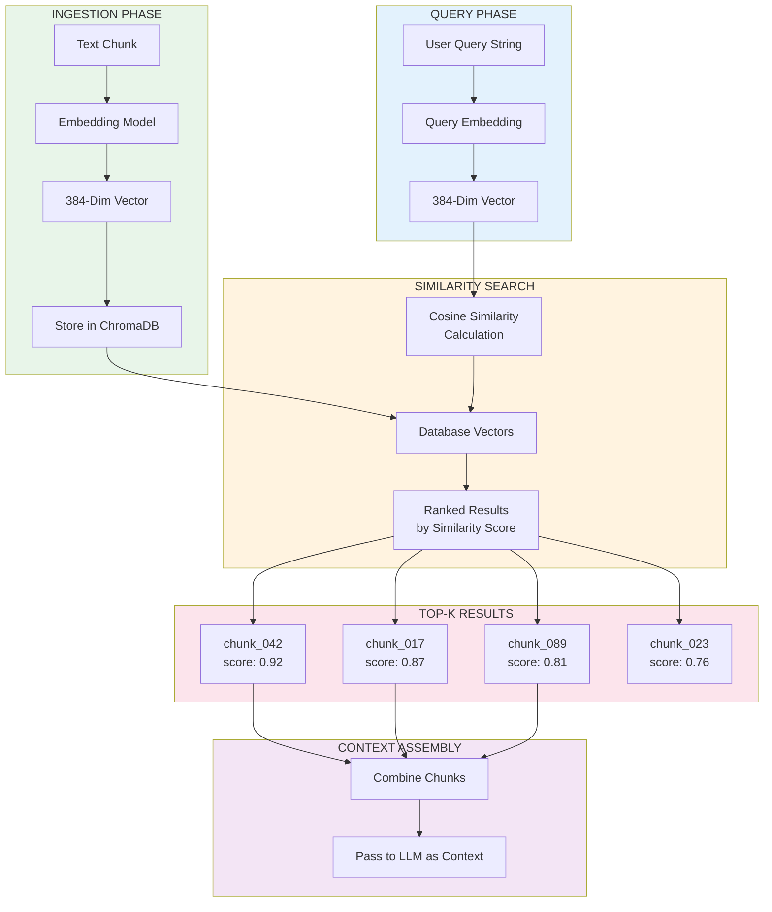
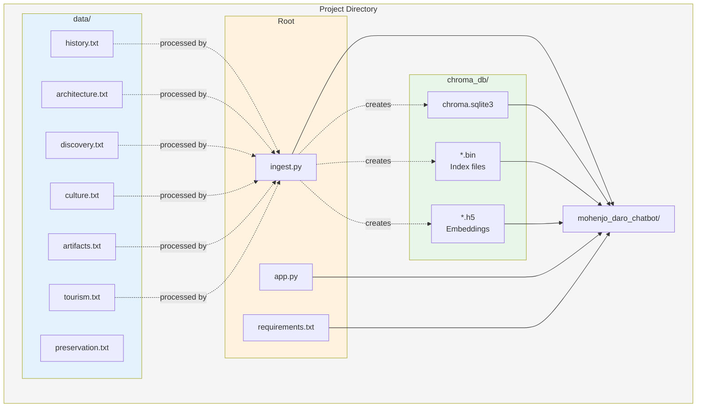
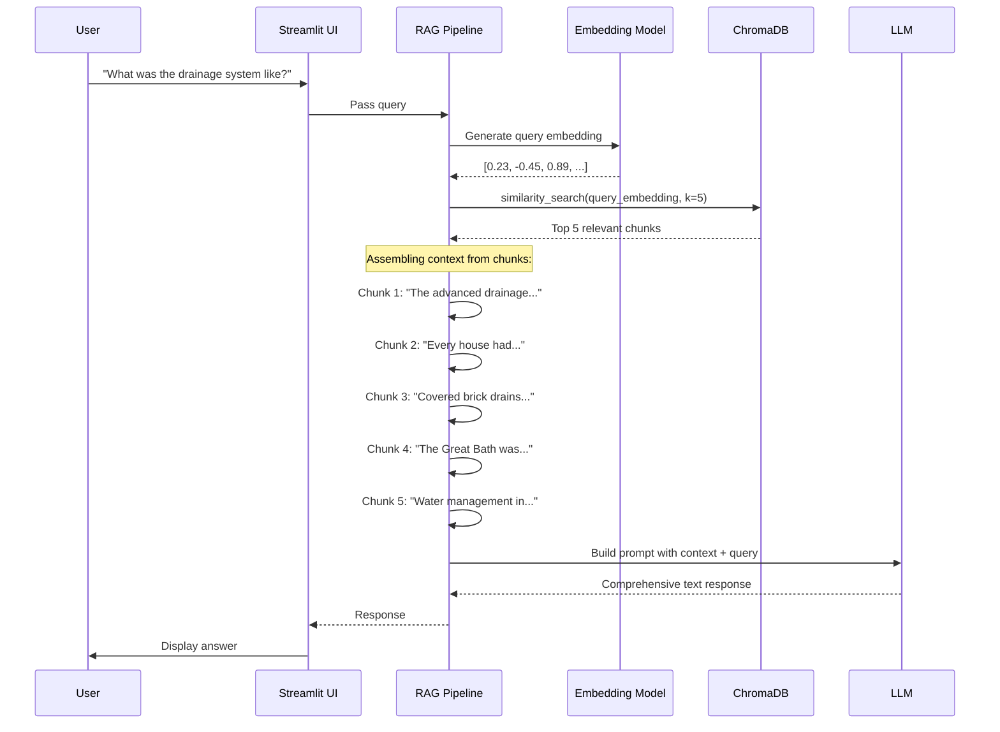

# Mohenjo-daro Knowledge Base - Database Structure Diagram

## Data Architecture Overview



---

## ChromaDB Collection Structure

```mermaid
flowchart TD
    subgraph Collection["Collection: mohenjo_daro_kb"]
        subgraph Metadata["Metadata Schema"]
            M1[category: str]
            M2[source: str]
            M3[chunk_id: int]
            M4[title: str]
            M5[created_at: datetime]
        end

        subgraph Vectors["Vector Storage"]
            V1[Embedding Vector<br/>384 floats]
            V2[Embedding Vector<br/>384 floats]
            V3[Embedding Vector<br/>384 floats]
            V4[... more vectors"]
        end

        subgraph Documents["Document Storage"]
            D1["chunk_001: 'Mohenjo-daro was<br/>one of the largest<br/>settlements of the<br/>ancient Indus Valley...'"]
            D2["chunk_002: 'The city was<br/>founded around 2500<br/>BCE and featured<br/>advanced drainage...'"]
            D3["chunk_003: 'Archaeological<br/>excavations revealed<br/>standardized brick<br/>sizes indicating...'"]
            D4["... more chunks"]
        end
    end
```

---

## Knowledge Categories & Content Structure



---

## Text Chunking Process



---

## Embedding & Retrieval Flow



---

## File Storage Structure



---

## Query-to-Context Pipeline



---

## Database Schema Details

### ChromaDB Collection: `mohenjo_daro_kb`

| Field | Type | Description | Example |
|-------|------|-------------|---------|
| `id` | str | Unique chunk identifier | `chunk_001` |
| `embedding` | float[384] | Vector representation | `[0.23, -0.45, ...]` |
| `document` | str | Raw text content | `"Mohenjo-daro was..."` |
| `metadata.category` | str | Content category | `"architecture"` |
| `metadata.source` | str | Original source | `"history.txt"` |
| `metadata.chunk_id` | int | Sequential ID | `1` |
| `metadata.title` | str | Section title | `"Drainage System"` |

---

## Data Processing Configuration

```mermaid
flowchart TD
    subgraph Config["Ingestion Configuration"]
        C1[Chunk Size: 500 tokens]
        C2[Chunk Overlap: 50 tokens]
        C3[Embedding Model: all-MiniLM-L6-v2]
        C4[Vector Dimensions: 384]
        C5[Top-K Retrieval: 5 chunks]
        C6[Similarity Metric: Cosine]
    end

    subgraph Models["Embedding Models (Options)"]
        M1[all-MiniLM-L6-v2<br/>384 dims (default)]
        M2[all-mpnet-base-v2<br/>768 dims (high quality)]
        M3[paraphrase-MiniLM-L6-v2<br/>384 dims (semantic)]
    end
```

---

## Knowledge Flow Summary

```
┌─────────────────────────────────────────────────────────────────────────┐
│                        KNOWLEDGE BASE FLOW                              │
├─────────────────────────────────────────────────────────────────────────┤
│                                                                         │
│  ┌─────────────────┐                                                   │
│  │  SOURCE FILES   │  history.txt, architecture.txt, discovery.txt      │
│  │  (data/)        │  culture.txt, artifacts.txt, tourism.txt,          │
│  │                 │  preservation.txt                                  │
│  └────────┬────────┘                                                   │
│           │                                                              │
│           ▼                                                              │
│  ┌─────────────────┐                                                   │
│  │  INGEST.PY      │  Load → Chunk → Embed → Store                      │
│  │                 │                                                    │
│  │  • TextLoader   │                                                    │
│  │  • Recursive    │                                                    │
│  │    Character    │                                                    │
│  │    TextSplitter │                                                    │
│  │  • Sentence     │                                                    │
│  │    Transformers │                                                    │
│  └────────┬────────┘                                                   │
│           │                                                              │
│           ▼                                                              │
│  ┌─────────────────┐                                                   │
│  │  CHROMADB       │  Vector Database (deployed with app)                │
│  │                 │                                                    │
│  │  Collection:    │                                                    │
│  │  mohenjo_daro   │                                                    │
│  │  _kb            │                                                    │
│  │                 │                                                    │
│  │  ~100-200       │                                                    │
│  │  chunks         │                                                    │
│  └────────┬────────┘                                                   │
│           │                                                              │
│           ▼                                                              │
│  ┌─────────────────┐                                                   │
│  │  QUERY TIME     │  User Question → Embed → Search → Context           │
│  │                 │                                                    │
│  │  1. User asks   │                                                    │
│  │  2. Query       │                                                    │
│  │     embedded    │                                                    │
│  │  3. Semantic    │                                                    │
│  │     search      │                                                    │
│  │  4. Top-K       │                                                    │
│  │     chunks      │                                                    │
│  │  5. Combined    │                                                    │
│  │     context     │                                                    │
│  └────────┬────────┘                                                   │
│           │                                                              │
│           ▼                                                              │
│  ┌─────────────────┐                                                   │
│  │  LLM PROMPT     │  Context + Question → LLM → Response                │
│  └─────────────────┘                                                   │
│                                                                         │
└─────────────────────────────────────────────────────────────────────────┘
```
