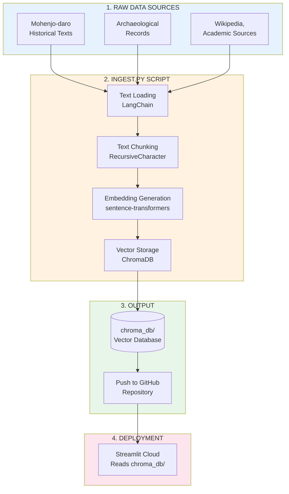
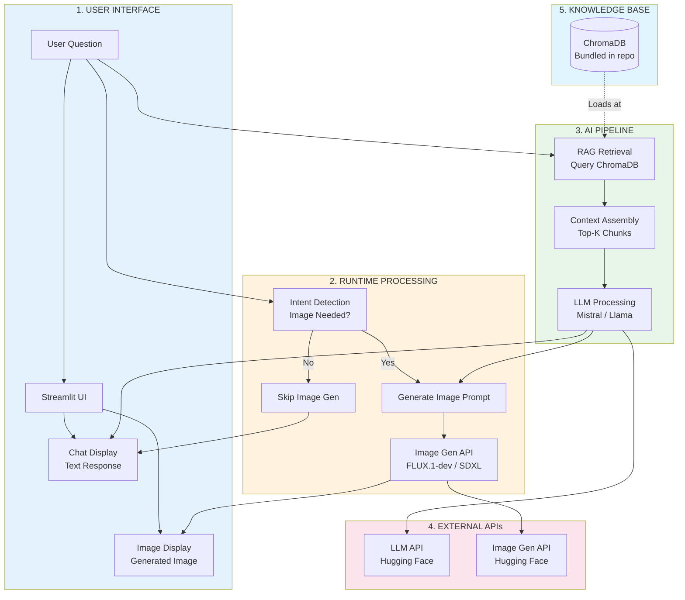
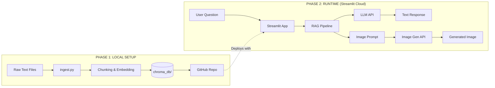
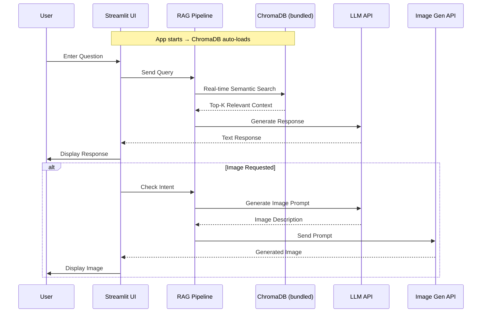

# Mohenjo-daro AI Chatbot & Image Generation System - High Level Flow Diagram

## Two-Phase System Overview

### Phase 1: Local Setup (One-time)
```
Raw Text Data → ingest.py → ChromaDB Database → Upload to GitHub
```

### Phase 2: Runtime on Streamlit Cloud
```
User Query → Streamlit App → ChromaDB (bundled) → LLM API → Response
```

---

## Phase 1: Local Setup & Knowledge Base Creation



---

## Phase 2: Runtime (User Interaction on Streamlit Cloud)



---

## Complete System Architecture



---

## System Components Summary

| Component | Phase | Purpose |
|-----------|-------|---------|
| **ingest.py** | Setup | Convert raw text → ChromaDB |
| ChromaDB | Setup+Runtime | Knowledge base storage |
| Streamlit | Runtime | Chat UI |
| LangChain | Setup+Runtime | RAG pipeline, chunking |
| LLM API | Runtime | Response generation |
| Image Gen API | Runtime | Visual content creation |
| Hugging Face | Runtime | Model hosting |

---

## File Structure

```
mohenjo-daro-chatbot/
├── data/
│   └── raw_mohenjo_daro_info.txt    ← Historical texts (Phase 1)
├── chroma_db/                       ← Generated by ingest.py (Phase 1)
│   └── ...
├── ingest.py                        ← Setup script (Phase 1)
├── app.py                           ← Main Streamlit app (Runtime)
├── requirements.txt
└── README.md
```

---

## Detailed Workflow

### Phase 1: Setup (Run Locally Once)
```
1. Collect raw text data about Mohenjo-daro
       ↓
2. python ingest.py
       ↓
3. Script loads text → chunks → embeds → stores in ChromaDB
       ↓
4. Commit chroma_db/ folder to GitHub
```

### Phase 2: Deployment & Runtime
```
1. Push to GitHub
       ↓
2. Connect to Streamlit Cloud
       ↓
3. Deploy app.py
       ↓
4. ChromaDB auto-loads from repo at startup
       ↓
5. Users interact in real-time
```

---

## Architecture Diagram (Text)

```
┌─────────────────────────────────────────────────────────────────────────┐
│                    MOHENJO-DARO AI CHATBOT SYSTEM                      │
├─────────────────────────────────────────────────────────────────────────┤
│                                                                         │
│  ╔═══════════════════════════════════════════════════════════════════╗ │
│  ║  PHASE 1: LOCAL SETUP (One-time)                                  ║ │
│  ╠═══════════════════════════════════════════════════════════════════╣ │
│  ║                                                                   ║ │
│  ║   ┌──────────────┐     ┌──────────────┐     ┌──────────────┐      ║ │
│  ║   │   Raw Text   │────▶│  ingest.py  │────▶│  ChromaDB    │      ║ │
│  ║   │   Files      │     │             │     │  Database    │      ║ │
│  ║   └──────────────┘     └──────────────┘     └──────────────┘      ║ │
│  ║                                                     │              ║ │
│  ║                                                     ▼              ║ │
│  ║                                            ┌──────────────┐       ║ │
│  ║                                            │  GitHub Repo │       ║ │
│  ║                                            └──────────────┘       ║ │
│  ║                                                                   ║ │
│  ╚═══════════════════════════════════════════════════════════════════╝ │
│                                                                         │
│  ╔═══════════════════════════════════════════════════════════════════╗ │
│  ║  PHASE 2: RUNTIME (Streamlit Cloud)                                ║ │
│  ╠═══════════════════════════════════════════════════════════════════╣ │
│  ║                                                                   ║ │
│  ║   ┌──────────────────────────────────────────────────────────┐  ║ │
│  ║   │                  STREAMLIT INTERFACE                       │  ║ │
│  ║   │                                                              │  ║ │
│  ║   │   ┌────────────────────┐    ┌────────────────────────────┐ │  ║ │
│  ║   │   │  User Question     │    │  Chat History              │ │  ║ │
│  ║   │   │  (st.chat_input)   │    │  (st.chat_message)         │ │  ║ │
│  ║   │   └────────────────────┘    │  - Text Responses          │ │  ║ │
│  ║   │                               │  - Generated Images       │ │  ║ │
│  ║   │                               └────────────────────────────┘ │  ║ │
│  ║   └──────────────────────────────────────────────────────────┘  ║ │
│  ║                                │                                  ║ │
│  ║                                ▼                                  ║ │
│  ║   ┌──────────────────────────────────────────────────────────┐  ║ │
│  ║   │              LANGCHAIN RAG PIPELINE                        │  ║ │
│  ║   │                                                              │  ║ │
│  ║   │   ┌───────────────┐        ┌─────────────────┐             │  ║ │
│  ║   │   │  Semantic     │───────▶│  Context        │             │  ║ │
│  ║   │   │  Retrieval    │        │  Assembly       │             │  ║ │
│  ║   │   │  (ChromaDB)   │        │                 │             │  ║ │
│  ║   │   └───────────────┘        └─────────────────┘             │  ║ │
│  ║   │          │                        │                       │  ║ │
│  ║   │          │                        ▼                       │  ║ │
│  ║   │          │              ┌─────────────────┐               │  ║ │
│  ║   │          │              │   LLM           │               │  ║ │
│  ║   │          │              │ (Mistral/Llama) │               │  ║ │
│  ║   │          │              └─────────────────┘               │  ║ │
│  ║   │          │                     │                         │  ║ │
│  ║   │          │           ┌──────────┴──────────┐              │  ║ │
│  ║   │          │           ▼                     ▼              │  ║ │
│  ║   │          │   ┌──────────────┐    ┌───────────────┐       │  ║ │
│  ║   │          │   │    Text      │    │  Image Prompt │       │  ║ │
│  ║   │          │   │   Response   │    │   Generator   │       │  ║ │
│  ║   │          │   └──────────────┘    └───────┬───────┘       │  ║ │
│  ║   └──────────┼───────────────────────────────┼───────────────┘  ║ │
│  ║              │                               │                 ║ │
│  ║              ▼                               ▼                 ║ │
│  ║   ┌─────────────────────────────────────────────────────────┐  ║ │
│  ║   │              HUGGING FACE APIS                           │  ║ │
│  ║   │                                                           │  ║ │
│  ║   │   ┌───────────────────────┐  ┌────────────────────────┐ │  ║ │
│  ║   │   │    LLM API            │  │   Image Generation API  │ │  ║ │
│  ║   │   │  Mistral-7B/Llama-3   │  │   FLUX.1-dev / SDXL     │ │  ║ │
│  ║   │   └───────────────────────┘  └────────────────────────┘ │  ║ │
│  ║   └─────────────────────────────────────────────────────────┘  ║ │
│  ║                                                                   ║ │
│  ║   ┌──────────────────────────────────────────────────────────┐  ║ │
│  ║   │  ChromaDB (loaded from GitHub at app startup)             │  ║ │
│  ║   └──────────────────────────────────────────────────────────┘  ║ │
│  ║                                                                   ║ │
│  ╚═══════════════════════════════════════════════════════════════════╝ │
└─────────────────────────────────────────────────────────────────────────┘
```

---

## Runtime Sequence (User Request)


