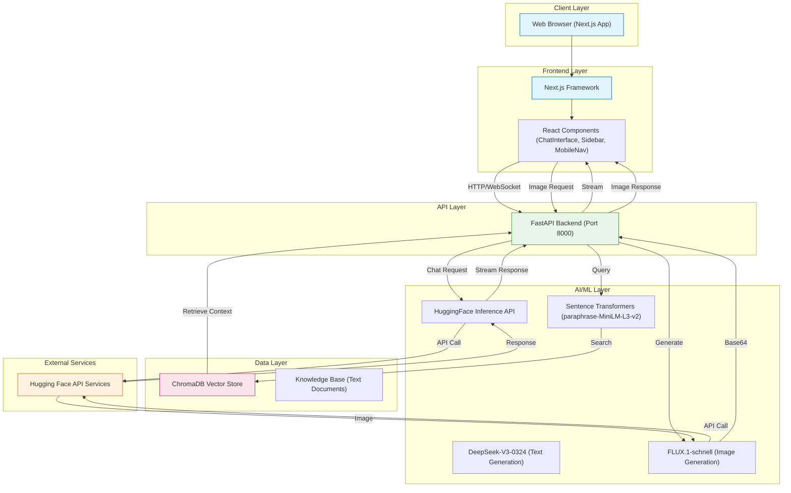

# System Overview - High Level Architecture

```mermaid
graph TB
    subgraph "Client Layer"
        Browser["Web Browser (Next.js App)"]
    end

    subgraph "Frontend Layer"
        NextJS["Next.js Framework"]
        UI["React Components (ChatInterface, Sidebar, MobileNav)"]
    end

    subgraph "API Layer"
        FastAPI["FastAPI Backend (Port 8000)"]
    end

    subgraph "AI/ML Layer"
        HF_Inference["HuggingFace Inference API"]
        Embeddings["Sentence Transformers (paraphrase-MiniLM-L3-v2)"]
        LLM["DeepSeek-V3-0324 (Text Generation)"]
        ImageGen["FLUX.1-schnell (Image Generation)"]
    end

    subgraph "Data Layer"
        ChromaDB["ChromaDB Vector Store"]
        KnowledgeBase["Knowledge Base (Text Documents)"]
    end

    subgraph "External Services"
        HF["Hugging Face API Services"]
    end

    Browser --> NextJS
    NextJS --> UI
    UI -->|HTTP/WebSocket| FastAPI
    FastAPI -->|Query| Embeddings
    Embeddings -->|Search| ChromaDB
    ChromaDB -->|Retrieve Context| FastAPI
    FastAPI -->|Chat Request| HF_Inference
    HF_Inference -->|API Call| HF
    HF -->|Response| HF_Inference
    HF_Inference -->|Stream Response| FastAPI
    FastAPI -->|Stream| UI
    UI -->|Image Request| FastAPI
    FastAPI -->|Generate| ImageGen
    ImageGen -->|API Call| HF
    HF -->|Image| ImageGen
    ImageGen -->|Base64| FastAPI
    FastAPI -->|Image Response| UI

    style Browser fill:#e1f5fe,stroke:#01579b
    style NextJS fill:#e1f5fe,stroke:#01579b
    style FastAPI fill:#e8f5e9,stroke:#2e7d32
    style HF fill:#fff3e0,stroke:#e65100
    style ChromaDB fill:#fce4ec,stroke:#c2185b
```