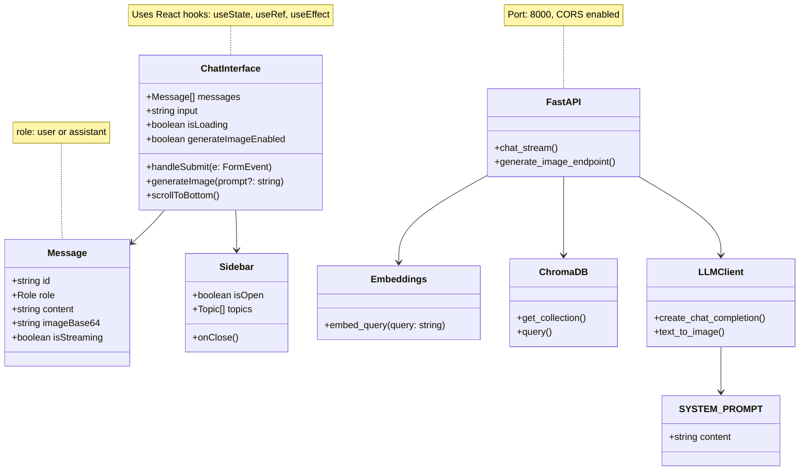

# Class Diagram - Low Level

```mermaid
classDiagram
    class ChatInterface {
        +Message[] messages
        +string input
        +boolean isLoading
        +boolean generateImageEnabled
        +handleSubmit(e: FormEvent)
        +generateImage(prompt?: string)
        +scrollToBottom()
    }

    class Message {
        +string id
        +Role role
        +string content
        +string imageBase64
        +boolean isStreaming
    }

    class Sidebar {
        +boolean isOpen
        +onClose()
        +Topic[] topics
    }

    class FastAPI {
        +chat_stream()
        +generate_image_endpoint()
    }

    class Embeddings {
        +embed_query(query: string)
    }

    class ChromaDB {
        +get_collection()
        +query()
    }

    class LLMClient {
        +create_chat_completion()
        +text_to_image()
    }

    class SYSTEM_PROMPT {
        +string content
    }

    ChatInterface --> Message
    ChatInterface --> Sidebar
    FastAPI --> Embeddings
    FastAPI --> ChromaDB
    FastAPI --> LLMClient
    LLMClient --> SYSTEM_PROMPT

    note for Message "role: user or assistant"
    note for ChatInterface "Uses React hooks: useState, useRef, useEffect"
    note for FastAPI "Port: 8000, CORS enabled"
```