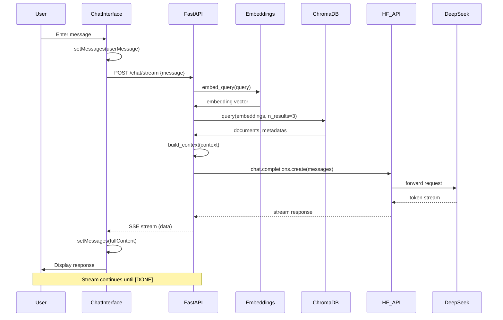
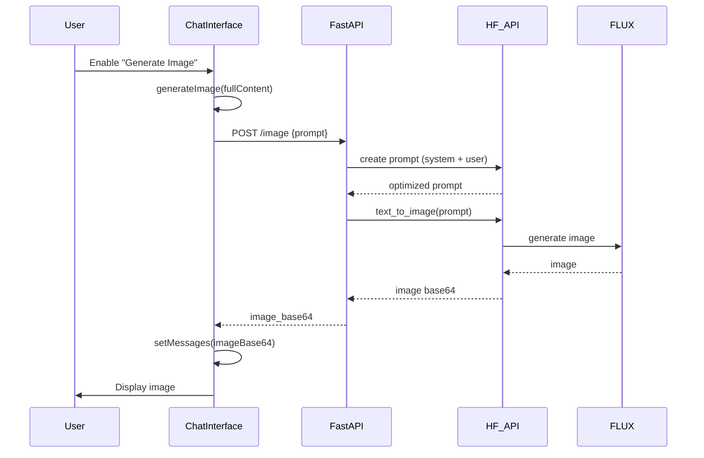

# Sequence Diagram - Chat Flow

```mermaid
sequenceDiagram
    participant User
    participant ChatInterface
    participant FastAPI
    participant Embeddings
    participant ChromaDB
    participant HF_API
    participant DeepSeek

    User->>ChatInterface: Enter message
    ChatInterface->>ChatInterface: setMessages(userMessage)
    ChatInterface->>FastAPI: POST /chat/stream {message}

    FastAPI->>Embeddings: embed_query(query)
    Embeddings->>FastAPI: embedding vector

    FastAPI->>ChromaDB: query(embeddings, n_results=3)
    ChromaDB->>FastAPI: documents, metadatas

    FastAPI->>FastAPI: build_context(context)

    FastAPI->>HF_API: chat.completions.create(messages)
    HF_API->>DeepSeek: forward request
    DeepSeek-->>HF_API: token stream

    HF_API-->>FastAPI: stream response

    FastAPI-->>ChatInterface: SSE stream (data)
    ChatInterface->>ChatInterface: setMessages(fullContent)
    ChatInterface->>User: Display response

    Note over User,FastAPI: Stream continues until [DONE]
```

```mermaid
sequenceDiagram
    participant User
    participant ChatInterface
    participant FastAPI
    participant HF_API
    participant FLUX

    User->>ChatInterface: Enable "Generate Image"
    ChatInterface->>ChatInterface: generateImage(fullContent)

    ChatInterface->>FastAPI: POST /image {prompt}

    FastAPI->>HF_API: create prompt (system + user)
    HF_API-->>FastAPI: optimized prompt

    FastAPI->>HF_API: text_to_image(prompt)
    HF_API->>FLUX: generate image
    FLUX-->>HF_API: image

    HF_API-->>FastAPI: image base64
    FastAPI-->>ChatInterface: image_base64

    ChatInterface->>ChatInterface: setMessages(imageBase64)
    ChatInterface->>User: Display image
```